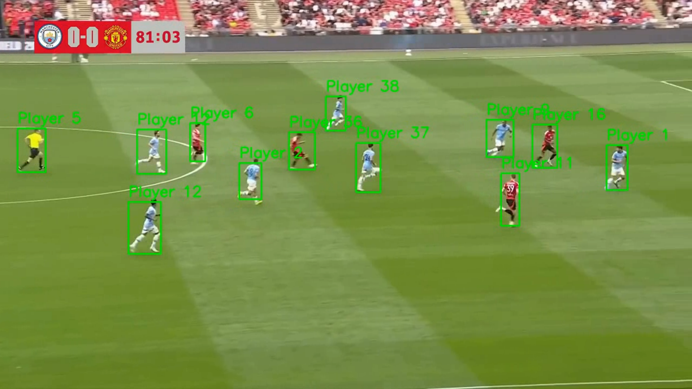
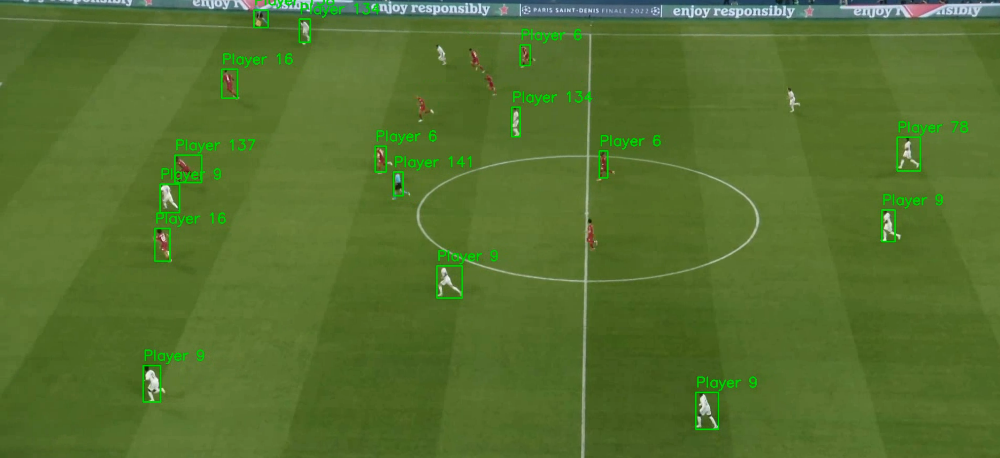

# Player Re-Identification System

[](https://github.com/sengarkunal/Player_Re-identification_System/blob/main/LICENSE)

A robust player re-identification system for sports analytics, capable of detecting and tracking players across different frames in sports videos using deep learning techniques.

This project implements a player re-identification system for sports videos. It can detect players in video frames and track their identities across frames using deep learning-based feature extraction.

## Features

- 🎯 **Player Detection**: Utilizes Faster R-CNN for accurate player detection in video frames
- 🖼️ **Feature Extraction**: Employs ResNet50 for robust feature representation
- 🔍 **Re-identification**: Implements cosine similarity for matching players across frames
- 🎥 **Video Processing**: Supports processing of video files with configurable parameters
- 📊 **Visualization**: Provides visual feedback with bounding boxes and player IDs
- ⚡ **GPU Acceleration**: Optimized for CUDA-enabled devices

## Examples

Here are some screenshots showing the system in action:

<div align="center">
  
  
  <p><em>Player detection and re-identification results on sports footage</em></p>
</div>

## Installation

1. Clone this repository:
```bash
git clone https://github.com/sengarkunal/Player_Re-identification_System.git
cd Player_Re-identification_System
```

2. Create and activate a virtual environment (recommended):
```bash
python -m venv venv
source venv/bin/activate  # On Windows: venv\Scripts\activate
```

3. Install the required dependencies:
```bash
pip install -r requirements.txt
```

## Usage

1. Prepare your input video file (MP4 format recommended)

2. Run the player re-identification script:
```bash
python player_reid.py --input path/to/your/video.mp4 --output output_video.mp4
```

### Arguments:
- `--input`: Path to the input video file (required)
- `--output`: Path to save the processed video (default: 'output_video.mp4')
- `--confidence`: Detection confidence threshold (default: 0.8)
- `--similarity`: Feature similarity threshold for re-identification (default: 0.7)

### Example:
```bash
python player_reid.py --input video_resources/tacticam.mp4 --output results/processed_tacticam.mp4 --confidence 0.75
```

## Configuration

You can modify the following parameters in the `main()` function of `player_reid.py`:

- `video_path`: Path to the input video file
- `output_path`: Path to save the output video
- `confidence_threshold`: Detection confidence threshold (default: 0.8)
- `similarity_threshold`: Feature similarity threshold for re-identification (default: 0.7)

## Requirements

- Python 3.8+
- PyTorch 2.0+
- OpenCV 4.5+
- NumPy 1.20+
- scikit-learn 1.0+
- tqdm 4.60+

## Project Structure

```
Player_Re-identification_System/
├── player_reid.py        # Main implementation of player re-identification
├── process_folder.py     # Script for batch processing multiple videos
├── requirements.txt      # Project dependencies
├── video_resources/      # Sample videos for testing
│   ├── 15sec_input_720p.mp4
│   ├── broadcast.mp4
│   ├── tacticam.mp4
│   └── README.md
└── processed_videos/     # Output directory for processed videos
```

## Notes

- The system works best with clear views of players and consistent lighting conditions
- Performance may vary depending on video quality, resolution, and camera angle
- For optimal results, consider fine-tuning the model on your specific dataset
- The current implementation is optimized for sports videos with medium to high resolution

## Contributing

Contributions are welcome! Please feel free to submit a Pull Request.

## License

This project is licensed under the MIT License - see the [LICENSE](LICENSE) file for details.

## Acknowledgments

- Built with PyTorch and OpenCV
- Pre-trained models from TorchVision
- Inspired by state-of-the-art re-identification research
